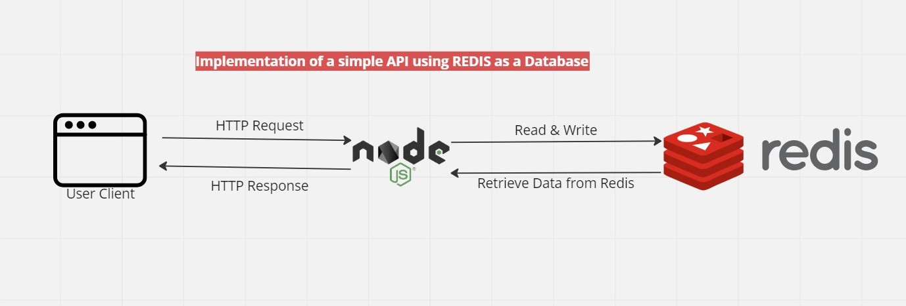

# Redis_DB

## Background Context

An implementation of a CRUD API using NodeJS and redis as a Non-relational database.

Redis is an in-memory data structure store, used as a distributed, in-memory key-value database, cache and message broke with optional durability.

Here is the gist, most people don't know that redis can be used as a non-relational database. Well, before now redis is mostly used for caching and message broking. In recent times, it can be used as a Non-relational database. Since Redis offers cashing and message broking out of the box already it makes it fun and interest using it as a primary database for applications.

Redis provides a package called Redis OM. This is a library that provides object mapping for Redis, see it like an ORM or an ODM. It enable developers communicate with the redis server easily.

As you can see from the above diagram, this project is just a simple CRUD API implemented using NodeJS as the server runtime environment, expressJS, a framework for NodeJS and Redis as the primary database.

It should be noted that for this project, the redis cloud was used and not the local storage(localhost). However the local storage can be used as well.

## Functionalities
- Creating a user to the Redis database
- Retrieving a particular user created from the Redis database
- Updating a user information in the Redis database
- Deleting a user from the Redis database
- Retrieving all users created from the Redis database.

## methods
- **createPerson**: This method creates a new user and saves it in the database. It takes in firstname, lastname, age, email and password as request body
- **getPersonById**: This method retirieves a user by the id. It is implemented by passing the id as a request parameter.
- **updatePerson**: This method updates a user by the id of that id. It is implemented by passing the id as a request parameter and also the firstname, lastname, age, email, and password as request body.
- **deletePerson**: This method deletes a user by the id. It is implemented by passing the id as a request parameter.
- **getAllPersons**: This method retrieves all the users saved in the Redis database.

## Endpoints
- *POST* **http://localhost:2011/api/person** - create a new user
- *GET* **http://localhost:2011/api/person/:id** - retrieves a particular user
- *PUT* **http://localhost:2011/api/person/:id** - updates a particular user
- *DELETE* **http://localhost:2011/api/person/:id** - deletes a particular user
- *GET* **http://localhost:2011/api/persons** - retrieve all users

